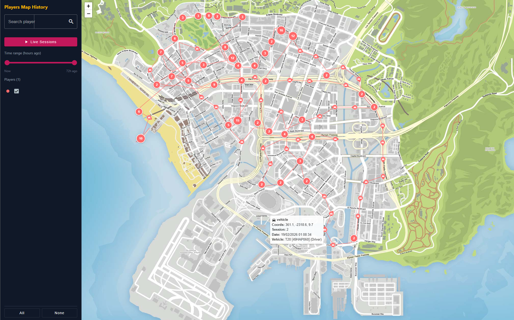

# Players Map History

Outil de modération pour serveur FiveM permettant de visualiser l'historique des déplacements des joueurs sur une carte interactive de GTA V.

> Pour les détails techniques complets (architecture, modèle de données, configuration, déploiement), voir [SPEC.md](docs/SPEC.md).

---

## Principe

Le script enregistre automatiquement et en continu la position de chaque joueur connecté au serveur. Ces données sont ensuite consultables via une interface web dédiée, où les modérateurs peuvent rejouer les trajectoires, filtrer par joueur ou par période, et suivre les déplacements en temps réel.

## Ce qui est enregistré

Chaque enregistrement (appelé "snapshot") capture :

- **Position et orientation** du joueur sur la carte
- **État du joueur** : à pied, en marche, en course, en sprint, en nage, en plongée, en parachute, en escalade, en chute, en véhicule, au sol (ragdoll), ou mort
- **Véhicule** (si applicable) : modèle, plaque d'immatriculation, et place occupée (conducteur ou passager)
- **Arme en main** (si applicable) : type d'arme, et si le joueur est en train de viser
- **Apparence** : tenue vestimentaire complète du joueur

## Fréquence d'enregistrement

Le système utilise deux mécanismes complémentaires :

1. **Enregistrement périodique** : un snapshot est pris automatiquement à intervalle régulier (par défaut toutes les 30 secondes), garantissant un suivi continu même si rien ne change.

2. **Enregistrement instantané** : un snapshot est déclenché immédiatement quand un événement notable se produit :
    - Le joueur s'est déplacé d'une distance significative (200 mètres par défaut)
    - Le joueur change d'état (par exemple : passe de la marche à la conduite, ou meurt)
    - Le joueur monte, descend ou change de place dans un véhicule
    - Le joueur sort, range ou change d'arme
    - Le joueur commence ou arrête de viser

Si un joueur reste immobile sans aucun changement pendant une durée prolongée (5 minutes par défaut), les enregistrements périodiques sont suspendus pour éviter les doublons inutiles.

Tous ces paramètres (intervalles, distances, déclencheurs) sont configurables dans la configuration du serveur sans avoir à recompiler le script.

## Interface web

L'interface de modération se compose de deux éléments principaux :

### Carte interactive

- Fond de carte GTA V avec zoom de la vue d'ensemble jusqu'au niveau de la rue
- Chaque joueur est représenté par une couleur unique
- Les positions successives d'un joueur sont reliées par un trait pour visualiser sa trajectoire
- Les icônes des marqueurs changent selon l'état du joueur (piéton, véhicule, visée, etc.)
- Au dézoom, les points proches se regroupent automatiquement pour garder la carte lisible
- Au survol d'un point, une info-bulle affiche les détails : coordonnées, véhicule, arme, état, date et heure

### Panneau latéral

- **Liste des joueurs** : cocher ou décocher individuellement chaque joueur pour l'afficher ou le masquer sur la carte
- **Recherche** : trouver un joueur par son nom
- **Sélecteur de période** : ajuster la plage temporelle avec un curseur à deux poignées pour ne voir que les données d'une fenêtre de temps précise
- **Mode live** : activer le suivi en temps réel pour voir les joueurs connectés se déplacer sur la carte au fur et à mesure (en fonction du délai de rafraîchissement configuré)

## Composants du projet

Le projet est organisé en trois parties indépendantes :

1. **Script FiveM** : s'exécute sur le serveur de jeu, collecte les données des joueurs et les stocke en base de données
2. **Serveur web** : fournit les données au client web via une interface de programmation et une connexion temps réel
3. **Client web** : l'interface de visualisation avec la carte interactive, accessible depuis un navigateur

Les données sont conservées en base pendant 30 jours par défaut, puis supprimées automatiquement.
